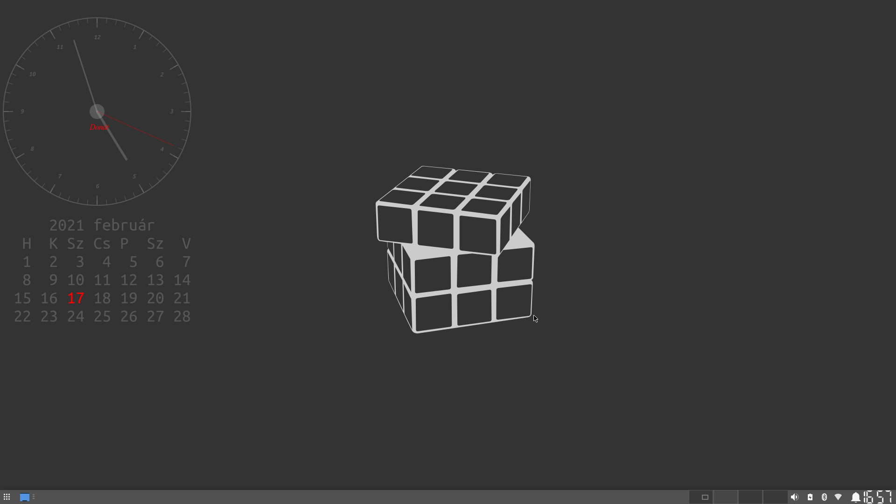

# Magyar névnap naptár és óra a conkyhoz

## Telepítés

A `conky` telepítése után `.conky` mappát egyszerűen át kell másolni a saját mappába, majd:

```
cd .conky
chmod +x cal.lua
conky -c clock_conky.conf 
```
## Képernyőkép


